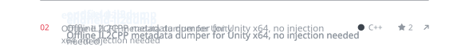

<!--
  This README is generated. Edit teto/README.template.md and teto/config.json, then run:
    pip install fonttools brotli && python teto/build.py
  Actions rebuild it every day (teto-daily) and when someone talks to Teto (teto-issue).

  The banner, Teto's lines, the counter and the 0401 marks follow her mood (fed, hungry, birthday).
  Every piece comes in a dark and a light version and <picture> shows the one for the reader's
  GitHub theme. Full-width pieces keep their own height and reflow for narrow screens by themselves.
  Each block is one 
: GitHub puts 16px under it, the rest of the spacing is inside the images.
-->

  <picture>
    <source media="(prefers-color-scheme: light) and (prefers-reduced-motion: reduce)" srcset="./assets/teto/banner-light-static.png">
    <source media="(prefers-reduced-motion: reduce)" srcset="./assets/teto/banner-static.png">
    <source media="(prefers-color-scheme: light)" srcset="./assets/teto/banner-light.webp">
    
  </picture>

  <picture><source media="(prefers-color-scheme: dark)" srcset="./assets/teto/dialogue-dark-945365f.svg"><source media="(prefers-color-scheme: light)" srcset="./assets/teto/dialogue-light-632a04f.svg"></picture>

  <a href="https://github.com/2md55nmxkw-arch/2md55nmxkw-arch/issues/new?title=teto%7Cfeed&body=%F0%9F%A5%96+A+baguette+for+Teto.%0A%0AJust+press+%2A%2ACreate%2A%2A.+Teto+answers+here+and+on+the+profile+in+about+a+minute.%0A%0APlease+don%27t+change+the+title."><picture><source media="(prefers-color-scheme: dark)" srcset="./assets/teto/btn-feed-dark-b7b7a81.svg"><source media="(prefers-color-scheme: light)" srcset="./assets/teto/btn-feed-light-b7b7a81.svg"></picture></a>
  <a href="https://github.com/2md55nmxkw-arch/2md55nmxkw-arch/issues/new?title=teto%7Cnews&body=Teto%2C+what%27s+new%3F%0A%0AJust+press+%2A%2ACreate%2A%2A.+Teto+answers+here+and+on+the+profile+in+about+a+minute.%0A%0APlease+don%27t+change+the+title."><picture><source media="(prefers-color-scheme: dark)" srcset="./assets/teto/btn-news-dark-9f92784.svg"><source media="(prefers-color-scheme: light)" srcset="./assets/teto/btn-news-light-8446a60.svg"></picture></a>
  <a href="https://github.com/2md55nmxkw-arch/2md55nmxkw-arch/issues/new?title=teto%7Cpoke&body=%2Apoke%2A%0A%0AJust+press+%2A%2ACreate%2A%2A.+Teto+answers+here+and+on+the+profile+in+about+a+minute.%0A%0APlease+don%27t+change+the+title."><picture><source media="(prefers-color-scheme: dark)" srcset="./assets/teto/btn-poke-dark-2051f74.svg"><source media="(prefers-color-scheme: light)" srcset="./assets/teto/btn-poke-light-76e2354.svg"></picture></a>
   
  <picture><source media="(prefers-color-scheme: dark)" srcset="./assets/teto/counter-dark-15fd28f.svg"><source media="(prefers-color-scheme: light)" srcset="./assets/teto/counter-light-809443f.svg"></picture>
   
  <a href="https://github.com/RATWareLua" title="@RATWareLua fed her"><picture><source media="(prefers-color-scheme: dark)" srcset="./assets/teto/guest-ratwarelua-dark-68dd620.svg"><source media="(prefers-color-scheme: light)" srcset="./assets/teto/guest-ratwarelua-light-ea9e9c3.svg"></picture></a>
  <a href="https://github.com/2md55nmxkw-arch" title="@2md55nmxkw-arch fed her"><picture><source media="(prefers-color-scheme: dark)" srcset="./assets/teto/guest-2md55nmxkw-arch-dark-b263dbc.svg"><source media="(prefers-color-scheme: light)" srcset="./assets/teto/guest-2md55nmxkw-arch-light-b169ae7.svg"></picture></a>

  <picture><source media="(prefers-color-scheme: dark)" srcset="./assets/teto/sep-projects-dark-b85b940.svg"><source media="(prefers-color-scheme: light)" srcset="./assets/teto/sep-projects-light-8d6cf98.svg"></picture>

  <a href="https://github.com/2md55nmxkw-arch/tzar-hub"><picture><source media="(prefers-color-scheme: dark)" srcset="./assets/teto/row-tzar-hub-dark-e8590e7.svg"><source media="(prefers-color-scheme: light)" srcset="./assets/teto/row-tzar-hub-light-f64889d.svg"></picture></a> 
  <a href="https://github.com/2md55nmxkw-arch/endfield-il2dump"><picture><source media="(prefers-color-scheme: dark)" srcset="./assets/teto/row-endfield-il2dump-dark-d5cea1e.svg"><source media="(prefers-color-scheme: light)" srcset="./assets/teto/row-endfield-il2dump-light-0433461.svg"></picture></a> 
  <a href="https://github.com/2md55nmxkw-arch/Loliland-ModLoader"><picture><source media="(prefers-color-scheme: dark)" srcset="./assets/teto/row-loliland-modloader-dark-4e8a97c.svg"><source media="(prefers-color-scheme: light)" srcset="./assets/teto/row-loliland-modloader-light-3ce5632.svg"></picture></a>

  <picture><source media="(prefers-color-scheme: dark)" srcset="./assets/teto/sep-activity-dark-336da17.svg"><source media="(prefers-color-scheme: light)" srcset="./assets/teto/sep-activity-light-7ef8591.svg"></picture>

  <picture><source media="(prefers-color-scheme: dark)" srcset="./assets/teto/activity-dark-6a7645e.svg"><source media="(prefers-color-scheme: light)" srcset="./assets/teto/activity-light-bc60a98.svg"></picture>

  <picture><source media="(prefers-color-scheme: dark)" srcset="./assets/teto/sep-stack-dark-14e5a58.svg"><source media="(prefers-color-scheme: light)" srcset="./assets/teto/sep-stack-light-c195193.svg"></picture>

  <picture><source media="(prefers-color-scheme: dark)" srcset="./assets/teto/stack-dark-f6acb5f.svg"><source media="(prefers-color-scheme: light)" srcset="./assets/teto/stack-light-c689bfd.svg"></picture>
   
  <picture><source media="(prefers-color-scheme: dark)" srcset="./assets/teto/chip-luau-dark-6c6b73f.svg"><source media="(prefers-color-scheme: light)" srcset="./assets/teto/chip-luau-light-7c453d5.svg"></picture>
  <picture><source media="(prefers-color-scheme: dark)" srcset="./assets/teto/chip-typescript-dark-534cb99.svg"><source media="(prefers-color-scheme: light)" srcset="./assets/teto/chip-typescript-light-ffb743e.svg"></picture>
  <picture><source media="(prefers-color-scheme: dark)" srcset="./assets/teto/chip-lua-dark-ce777b4.svg"><source media="(prefers-color-scheme: light)" srcset="./assets/teto/chip-lua-light-c0a620f.svg"></picture>
  <picture><source media="(prefers-color-scheme: dark)" srcset="./assets/teto/chip-css-dark-7331e0e.svg"><source media="(prefers-color-scheme: light)" srcset="./assets/teto/chip-css-light-608df63.svg"></picture>
  <picture><source media="(prefers-color-scheme: dark)" srcset="./assets/teto/chip-javascript-dark-f11ce25.svg"><source media="(prefers-color-scheme: light)" srcset="./assets/teto/chip-javascript-light-d30a663.svg"></picture>
  <picture><source media="(prefers-color-scheme: dark)" srcset="./assets/teto/chip-other-dark-a4452bc.svg"><source media="(prefers-color-scheme: light)" srcset="./assets/teto/chip-other-light-598d14c.svg"></picture>

  <picture><source media="(prefers-color-scheme: dark)" srcset="./assets/teto/footer-dark-1c4ada0.svg"><source media="(prefers-color-scheme: light)" srcset="./assets/teto/footer-light-51423e6.svg"></picture>

